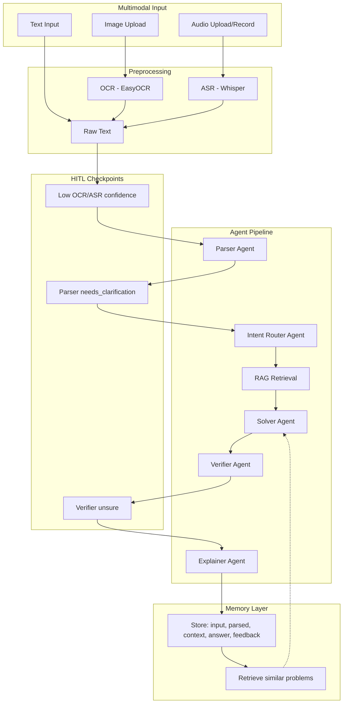

# Math Mentor – Multimodal RAG + Agents + HITL + Memory

A JEE-style math mentor that accepts **text**, **image** (photo/screenshot), or **audio** input, parses the problem, retrieves relevant knowledge, solves with a multi-agent pipeline, verifies the answer, and explains step-by-step. It supports **human-in-the-loop** at low-confidence steps and **memory** for similar-problem reuse.

**Full workflow and technical overview:** see [docs/PROJECT_WORKFLOW_AND_TECHNICAL_OVERVIEW.md](docs/PROJECT_WORKFLOW_AND_TECHNICAL_OVERVIEW.md) for end-to-end flow, all 5 agents, tech stack, and design decisions.

The agent pipeline is built with **LangGraph** (see `src/agents/graph.py`): a state graph with nodes Parser → Router → Retrieve → Solver → Verifier → Explainer and conditional edges for HITL (parser clarification, verifier approval).

## Demo video

**[▶ Demo (screen recording)](LINK_HERE)** — Replace `LINK_HERE` with a link to your video (e.g. YouTube, Google Drive, or the repo’s `Demo_video/` file after pushing with Git LFS).

To add the video to the repo with Git LFS (run from project root; close any app that might be using the file if LFS reports "Access denied"):

```bash
git lfs track "Demo_video/*.mp4"
git add "Demo_video/Screen Recording 2026-03-10 004226.mp4" .gitattributes
git commit -m "Add demo video"
git push
```

## Architecture



## Setup

### 1. Clone and install

```bash
cd "Planet Ai Assignment"
python -m venv venv
venv\Scripts\activate   # Windows
# source venv/bin/activate  # macOS/Linux
pip install -r requirements.txt
```

### 2. Environment

Copy `.env.example` to `.env` and set your keys:

```bash
copy .env.example .env
```

Edit `.env` and set at least:

- `OPENAI_API_KEY` – required for Parser, Router, Solver, Verifier, Explainer

Optional: adjust `OCR_CONFIDENCE_THRESHOLD`, `VERIFIER_CONFIDENCE_THRESHOLD`, `RAG_TOP_K`, paths, and model names as needed.

### 3. Build RAG index (recommended)

Populate the vector store from the curated knowledge base (algebra, probability, calculus, linear algebra, templates, common mistakes). Embeddings use **OpenAI** by default (`EMBEDDING_PROVIDER=openai`, `EMBEDDING_MODEL=text-embedding-3-small`). If you had an index built with sentence-transformers, delete `data/chroma` and re-run.

```bash
python scripts/build_rag.py
```

This creates `data/chroma` and indexes all `.md`/`.txt` under `knowledge_base/`. If you skip this step, retrieval will return no chunks until the index exists.

### 4. Run the app

From the project root:

```bash
streamlit run app/main.py
```

Open the URL shown (e.g. http://localhost:8501).

## Usage

- **Text:** Type a math question and click **Solve**.
- **Image:** Upload a JPG/PNG of a problem. OCR runs automatically; edit the extracted text if needed, then **Confirm and Solve**.
- **Audio:** Upload WAV/MP3 (or record if your host supports it). Edit the transcript if needed, then **Confirm and Solve**.

The UI shows:

- **Agent trace** – which agents ran and their outputs
- **Retrieved context** – chunks from the knowledge base used for the answer (no hallucinated citations)
- **Final answer** and **Confidence** (High / Medium / Low)
- **Explanation** – step-by-step tutor-style explanation
- **Correct** / **Incorrect** – feedback is stored in memory for future similar-problem reuse

HITL triggers when:

- OCR/ASR confidence is low → edit/confirm extracted text
- Parser sets `needs_clarification` → confirm or edit parsed problem
- Verifier confidence is below threshold → **Approve** (keep solution and get explanation) or **Reject** (start over)

**Re-check** runs the flow again for the same input (e.g. to re-verify).

## Project layout

| Area   | Path |
|--------|------|
| Input  | `src/input/` – text, image (OCR), audio (ASR) |
| Agents | `src/agents/` – Parser, Router, Solver, Verifier, Explainer; LangGraph pipeline in `graph.py` |
| Tools  | `src/tools/calculator.py` – sympy-based safe math |
| RAG    | `src/rag/` – chunker, embedder, Chroma store, retriever |
| Memory | `src/memory/` – SQLite store, similar-problem retriever |
| KB     | `knowledge_base/*.md` – formulas, templates, pitfalls |
| Scripts | `scripts/` – build_rag.py, run_with_rag, generate_sample_audio |
| Docs   | `docs/` – workflow and technical overview |
| UI     | `app/main.py` – Streamlit app |

## Deployment

### Deploy on Streamlit Community Cloud (step-by-step)

1. **Push your app to GitHub**  
   Your repo is already at: `https://github.com/nileshkkolekar/Math-Mentor_Langraph.git`.

2. **Go to Streamlit Community Cloud**  
   Open [share.streamlit.io](https://share.streamlit.io) and sign in with GitHub.

3. **New app**  
   Click **“New app”**, then:
   - **Repository:** `nileshkkolekar/Math-Mentor_Langraph`
   - **Branch:** `main`
   - **Main file path:** `app/main.py`
   - **App URL:** choose a name (e.g. `math-mentor-langraph`).

4. **Secrets (required)**  
   In the same dialog or later under **App → Settings → Secrets**, add:
   ```toml
   OPENAI_API_KEY = "sk-your-openai-key-here"
   ```
   Without this, the app will not work.

5. **Advanced settings → Run command**  
   Set the run command to:
   ```bash
   streamlit run app/main.py --server.port $PORT
   ```
   (Streamlit often fills this by default.)

6. **Deploy**  
   Click **“Deploy”**. The first build can take several minutes (EasyOCR, Whisper, etc.).

7. **RAG on Streamlit Cloud (persistent)**  
   To avoid rebuilding the index on every deploy, use **Chroma Cloud**:
   - Sign up at [trychroma.com](https://www.trychroma.com/) and create a database (note your **API key**, **tenant**, **database**).
   - In Streamlit **Settings → Secrets**, add:
     ```toml
     OPENAI_API_KEY = "sk-your-openai-key"
     CHROMA_API_KEY = "your-chroma-cloud-api-key"
     CHROMA_TENANT = "your-tenant-id"
     CHROMA_DATABASE = "your-database-name"
     ```
   - Run `python scripts/build_rag.py` **once** locally (with the same `CHROMA_*` in `.env`) so your knowledge base is uploaded to Chroma Cloud. After that, the deployed app will use Chroma Cloud and retrieval will persist across restarts.
   - If you prefer not to use Chroma Cloud: use **Option A** (run `run_with_rag.sh` as start command to rebuild index on each deploy) or **Option B** (commit `data/chroma`).

Your app will be live at: `https://<your-app-name>.streamlit.app`.

---

- **Hugging Face Spaces:** New Space → Streamlit, add the repo and the same run command; set env vars in Settings.

After deployment, run `python scripts/build_rag.py` once (e.g. in a one-off job or at first start) so the Chroma index exists, or include a built index in the repo under `data/chroma` if the platform supports persistent storage.

### Errors you may see on cloud (and how to fix them)

| Issue | What you see | Fix |
|-------|----------------|-----|
| **Ephemeral filesystem** | After restart/redeploy, RAG shows "No chunks retrieved" and memory (feedback) is empty. | Use **Chroma Cloud** (set `CHROMA_API_KEY`, `CHROMA_TENANT`, `CHROMA_DATABASE` in Secrets and build index once); or rebuild RAG on startup with `run_with_rag.sh`; or commit `data/chroma`. |
| **Missing OPENAI_API_KEY** | "OpenAI API key not found" or agents return errors. | Set `OPENAI_API_KEY` in the platform’s **Secrets** or **Environment variables**. |
| **Wrong port** | App deploys but "Site unreachable" or 404. | Run with `--server.port $PORT` (Streamlit Cloud uses `$PORT`; HF Spaces may use `7860` – check the platform docs). |
| **Build / startup timeout** | Build or app start fails after several minutes. | Dependencies (EasyOCR, Whisper, sentence-transformers if used) are heavy. Prefer a platform with longer build time or smaller image; or build the RAG index locally and commit `data/chroma` so the app doesn’t need to run `build_rag.py` at startup. |
| **Out of memory** | App crashes or "Out of memory" during run. | Free tiers often have 1–2 GB RAM. Whisper + EasyOCR + Chroma can use a lot. Use Streamlit Cloud “standard” tier or a platform with more RAM; or disable Image/Audio and use Text-only for a lighter run. |
| **Audio (MP3/M4A) fails** | `FileNotFoundError` or "FFmpeg not found" when uploading non-WAV audio. | The cloud image usually **does not include ffmpeg**. Use **WAV** uploads (they work without ffmpeg), or use a custom Docker image that installs ffmpeg. |
| **RAG index missing on first deploy** | "No chunks retrieved" even though KB exists. | The `data/chroma` folder is not in the repo by default. Either: (1) Run `python scripts/build_rag.py` locally and commit `data/chroma` (if the platform allows large files), or (2) Run a build command that runs `build_rag.py` before starting the app (needs `OPENAI_API_KEY` in build env). |

**Optional: rebuild RAG on every startup**  
Use the provided script so the index is built when missing (handy on ephemeral filesystems): `bash scripts/run_with_rag.sh` (Linux/macOS/cloud) or `scripts\run_with_rag.bat` (Windows). Set your platform’s start command to that script instead of `streamlit run app/main.py`. First request may be slow while the index is built.

## Scope

Math scope is limited to: **Algebra**, **Probability**, **Basic calculus** (limits, derivatives, simple optimization), **Linear algebra basics** – JEE-style difficulty, not olympiad.

## Evaluation summary

- **Correctness:** Test with sample problems from each domain (algebra, probability, calculus, linear algebra). Verifier agent checks units, domain, and edge cases; low confidence triggers HITL for human approval.
- **RAG quality:** Retrieved chunks are shown in the UI; only top-k results are passed to the Solver, so there are no hallucinated citations. Run `python scripts/build_rag.py` to index the curated KB.
- **HITL triggers:** OCR/ASR low confidence → extraction preview and edit; parser `needs_clarification` → confirm/edit parsed problem; verifier low confidence → Approve (keep solution) or Reject (start over). "Re-check" re-runs the full pipeline.
- **Memory reuse:** Sessions with Correct/Incorrect feedback are stored in SQLite. Similar-problem retrieval (by topic and recent sessions) passes past solutions into the Solver prompt for pattern reuse. No model retraining.

## License

MIT.

# Math-Mentor_Langraph
